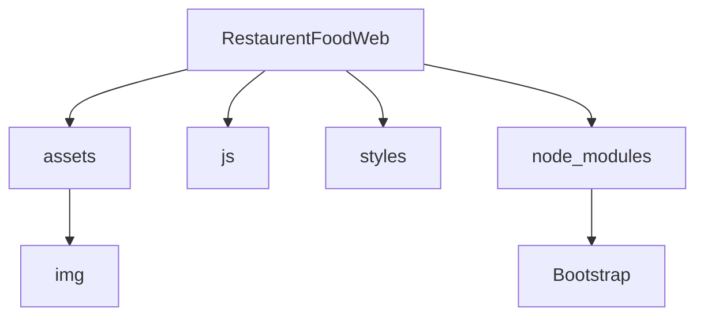

# Landing Page | restaurent-food-web.

## Tabla de Contenidos

1. [Requerimentos del proyecto](#id1)
2. [Diseño del proyecto](#id2)
3. [Frameworks del proyecto](#id3)
4. [Estructura del proyecto](#id4)
5. [Carpetas](#id5)
6. [Como clonar Repo y correrlo de manera local](#id6)

## Requerimentos del proyecto<a name="id1"></a>

Se desarrollara una landing para un restaurante, el requerimiento es el siguiente:

* Analizar diseño en figma
* Crear la estructura con html y css (maquetacion del sitio)
* Debe ser responsive
* Se puede trabajar de forma local y después subir a server pruebas

## Diseño del proyecto<a name="id2"></a>
  * <a href="https://www.figma.com/file/qvVdgdKthuqSUNBzmWOVtv/Restaurent-Food-Web-Landing-page-Design-(Community..." >Restaurent-Food-Web-Landing-page-Design-(Community)</a>
## Frameworks del proyecto<a name="id3"></a>

- `Bootstrap v5.3`:  Se usó Bootstrap para la estructura y diseño del proyeto, lo instalamos de manera local con ` npm install bootstrap@5.3.0-alpha1 ` para poder customizar SASS y se añade al ` package.json ` los datos necesarios.
  * <a href="https://getbootstrap.com/docs/5.3/getting-started/download/" > Documentación Bootstrap</a>
  
## Estructura del proyecto<a name="id4"></a>



Se separaron los directorios para tener una estructura limpia, los cuales estructuramos de la siguiente forma:

### Carpetas<a name="id5"></a>

- Carpeta `asssets`: Contiene una carpeta `img` donde se encuentran todas las imagenes incluidas en el proyecyo.

- Carpeta `js`: Por ahora el proyecto no contiene archivos JavaScript, pero se incluye un archivo `main.js` para su uso futuro.

- Carpeta `styles`: En esta carpeta contiene el archivo `custom.scss`, el cual se usó para extraer la libreria de estilos de Bootstrap, se usó la extensión `LIVE SASS COMPILER`, para importar la información y de esta forma se crearon los archivos `custom.css`, `custom.css.map` los cuales contienen los estilos aplicables al proyecto.

- Carpeta `node_modules`: En esta carpeta vienen los archivos bootstrap instalados con la libreria `npm`, la cual para poder subir al repositorio se tuvo que ignorar con el archivo `.gitignore` creado en la reiz del proyecto.

## Como clonar Repo y correrlo de manera local<a name="id6"></a>

* Primero debes ubicarte en la página principal del repositorio `<a href="https://github.com/OmarVenturaP/restaurent-food-web">`Restaurent Food Web`</a>`.
* Al estar en la página principal del Repositorio debes presionar el boton `<> Code` posteriormente en el apartado `Local` -> `Clone` -> `HTTPS` debes copiar el link de acceso al repo:


* Posteriormente debes abrir la linea de comandos Git Bash e ingresar el comando y el link al repo

```
git clone https://github.com/OmarVenturaP/restaurent-food-web
```

* Finalmente puedes apoyarte de la extensión en Visual Studio Code `live server` para ejecutar el proyecto de manera local y validar su correcto funcionamiento:

```
Go Live
```

<hr>
